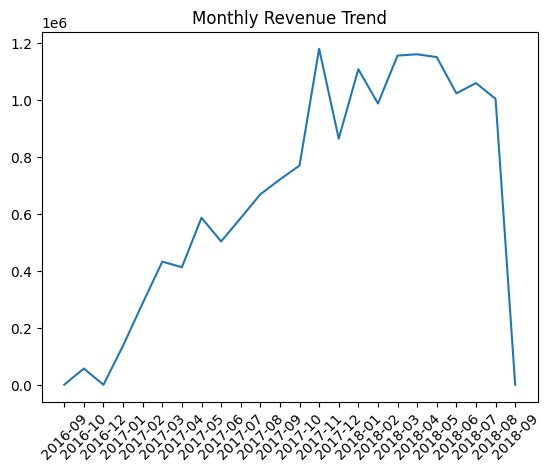

E-commerce Revenue Analysis & Growth Strategy
Project Overview

This project analyses an e-commerce dataset to identify the key drivers behind revenue trends and uncover opportunities for business growth. The objective was to move beyond basic reporting and perform **root cause analysis** to understand fluctuations in revenue performance.

---

Business Problem

The business experienced fluctuating revenue over time, with periods of strong growth followed by instability.

Key question:

*What is driving revenue changes, and how can the business improve consistency and growth?*

---

Data Sources

Dataset used: Brazilian E-commerce Public Dataset (Olist)

Download it here:
https://www.kaggle.com/datasets/olistbr/brazilian-ecommerce

Key tables used:
- Orders dataset  
- Order items dataset  
- Customers dataset  

---

Tools & Technologies

Python (Pandas, Matplotlib)
VS Code / Jupyter Notebook

---

Data Preparation

Merged multiple datasets using `order_id` and `customer_id`
Cleaned and formatted timestamp data
Created derived fields:

Revenue = Price + Freight
Month (for time-based analysis)

---

Key Analysis

1. Revenue Trend Analysis



* Analysed monthly revenue performance
* Identified **growth phase followed by fluctuations**
* Detected data inconsistency in the final month (excluded from analysis)

---

2. Order Volume Analysis

* Calculated number of orders per month
* Found strong correlation between:

**Revenue ↔ Order Volume**

---

3. Order Status Analysis

Breakdown:

* Delivered: Majority of orders and revenue
* Cancelled: Very low proportion (~0.5%)
* Other statuses (processing, shipped): minor but relevant

---

Key Insights

Insight 1: Revenue is driven by order volume

Revenue fluctuations closely follow changes in the number of orders, indicating:

> Customer demand is the primary driver of revenue variability

---

Insight 2: Cancellations are not a major issue

* Very low cancellation rate
* Minimal impact on overall revenue

---

Insight 3: Operational delays exist

* Some revenue tied up in non-delivered statuses
* Suggests inefficiencies in order fulfilment process

---

Insight 4: Data quality issue identified

* Final month shows a sharp drop due to incomplete data
* Excluded from business conclusions

---

Recommendations

1. Improve Customer Acquisition & Retention

* Focus on marketing channels driving consistent order volume
* Introduce loyalty programs to stabilise demand

---

2. Optimise Order Fulfilment

* Reduce processing and shipping delays
* Improve logistics efficiency

---

3. Monitor Operational KPIs

* Track order lifecycle metrics
* Identify bottlenecks in fulfilment

---

4. Business Impact

* Identified **primary revenue driver (order volume)**
* Highlighted operational inefficiencies
* Provided actionable recommendations to:

  * Improve revenue consistency
  * Enhance customer experience
  * Increase long-term growth

---

Project Structure

```
ecommerce-analysis/
 ├── data/
 ├── ecommerce-analysis.ipynb
 ├── README.md
```

---

Key Takeaway

> This project demonstrates the ability to move beyond descriptive analytics and perform **end-to-end business analysis**, identifying root causes and delivering actionable insights.

---
